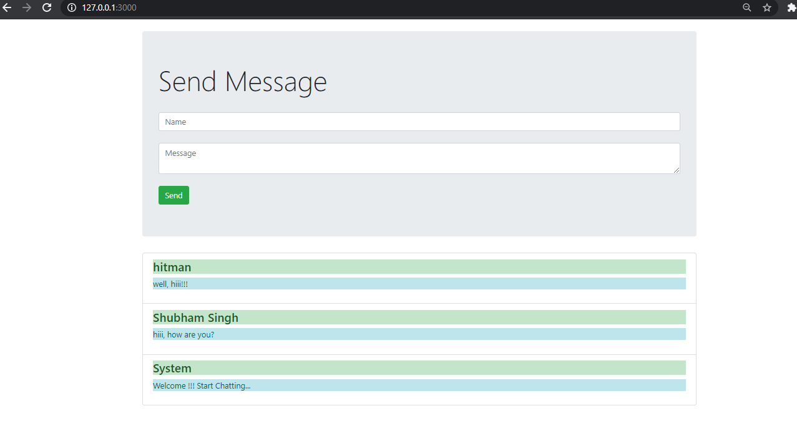

Chat App
-----
Basic chat app for conversation using NojeJs.

Steps to Run:
- install packages
```
$ npm install
```
- install nodemon for actively running
```
$ npm install nodemon -g
```
- Run App
```
$ nodemon
```

